# Jarvis Obsidian Sync

A companion Obsidian plugin for seamless integration with [Jarvis Bot](https://github.com/thalysguimaraes/jarvis-bot) - an AI-powered WhatsApp personal assistant that transcribes voice messages and manages tasks.

## 🤖 About Jarvis Bot Integration

This plugin connects your Obsidian vault directly to your Jarvis Bot instance, automatically syncing transcribed voice notes from WhatsApp into your knowledge management system. Perfect for capturing thoughts, ideas, and notes on-the-go.

## ✨ Features

- 🎤 **Voice Note Sync** - Automatically fetch transcribed voice messages from Jarvis Bot
- 📁 **Smart Organization** - Choose custom folders and naming patterns for your notes
- ⏰ **Auto Sync** - Configurable automatic syncing at regular intervals
- 📝 **Rich Formatting** - Notes include timestamps, metadata, and source information
- 🔒 **Secure** - API key authentication with your Jarvis Bot instance
- 🎯 **Intelligent Processing** - Leverages Jarvis Bot's AI classification and processing

## 🚀 Quick Start

### Prerequisites

1. **Jarvis Bot Instance** - Deploy your own [Jarvis Bot](https://github.com/thalysguimaraes/jarvis-bot)
2. **WhatsApp Integration** - Set up WhatsApp Business API with Z-API
3. **Obsidian** - Version 0.15.0 or later

### Installation

#### Option 1: Manual Installation (Recommended)

1. Download the latest release from [Releases](../../releases)
2. Extract to your Obsidian plugins directory:
   ```
   .obsidian/plugins/jarvis-obsidian-sync/
   ```
3. Enable the plugin in Obsidian Settings → Community plugins

#### Option 2: Build from Source

```bash
git clone https://github.com/thalysguimaraes/jarvis-obsidian-sync.git
cd jarvis-obsidian-sync
npm install
npm run build
```

Copy the built files (`main.js`, `manifest.json`, `styles.css`) to your Obsidian plugins directory.

### Configuration

1. **Get Your Jarvis Bot Details**:
   - Your deployed Jarvis Bot URL (e.g., `https://your-jarvis-bot.workers.dev`)
   - Your API key (set in Jarvis Bot's `OBSIDIAN_API_KEY` environment variable)

2. **Configure the Plugin**:
   - Open Obsidian Settings → Community plugins → Jarvis Obsidian Sync
   - Set your Jarvis Bot URL and API key
   - Choose your sync folder and preferences

3. **Test Connection**:
   - Click "Test Connection" to verify everything is working
   - You should see "✅ Connection successful!"

## 🎙️ How It Works

```mermaid
graph LR
    A[📱 WhatsApp Voice Message] --> B[🤖 Jarvis Bot]
    B --> C[🎯 OpenAI Whisper Transcription]
    C --> D[🧠 AI Classification]
    D --> E[💾 Cloud Storage]
    E --> F[🔄 Obsidian Plugin Sync]
    F --> G[📝 Obsidian Vault]
```



1. **Send a voice message** to your WhatsApp number connected to Jarvis Bot
2. **Jarvis Bot transcribes** using OpenAI Whisper and classifies the content
3. **Voice notes are stored** in Jarvis Bot's cloud storage with metadata
4. **Obsidian plugin fetches** unprocessed notes via secure API
5. **Notes are created** in your vault with rich formatting and organization

## 📖 Usage

### Automatic Sync
- Enable "Auto Sync" in settings for hands-free operation
- Configure sync interval (1-60 minutes)
- Plugin runs in background and syncs new voice notes automatically

### Manual Sync
- Click the microphone icon in the ribbon
- Use Command Palette: "Sync WhatsApp Voice Notes"
- Ideal for immediate syncing after recording important notes

### Voice Note Format

Synced notes are saved as Markdown files with comprehensive metadata:

```markdown
# Voice Note - 2024-08-04 14:30

**Date:** 2024-08-04 14:30
**Source:** WhatsApp (+5511999999999)
**ID:** abc12345-def67890

## Transcription

[Your transcribed voice message content here]

---
*Synced from Jarvis Bot WhatsApp Voice Notes*
```

## ⚙️ Configuration Options

| Setting | Description | Default |
|---------|-------------|---------|
| **Jarvis Bot URL** | Base URL of your Jarvis Bot instance | - |
| **API Key** | Authentication key for secure access | - |
| **Sync Folder** | Destination folder for voice notes | "WhatsApp Voice Notes" |
| **Auto Sync** | Enable automatic syncing | false |
| **Sync Interval** | How often to sync (minutes) | 5 |
| **Include Timestamp** | Add metadata to notes | true |
| **Date Format** | Timestamp format pattern | "YYYY-MM-DD HH:mm" |

## 🔧 Jarvis Bot Setup

### Required API Endpoints

Your Jarvis Bot needs these endpoints (included in latest version):

- `GET /api/voice-notes/unprocessed` - Fetch unprocessed voice notes
- `POST /api/voice-notes/{id}/processed` - Mark note as processed
- `GET /health` - Health check for connection testing

### Environment Variables

Add to your Jarvis Bot `.env` or Worker secrets:

```env
# Required for Obsidian integration
OBSIDIAN_API_KEY=your-secure-api-key-here
```

### CORS Configuration

The plugin automatically handles CORS for browser-based requests. Jarvis Bot includes proper CORS headers for Obsidian integration.

## 🚨 Troubleshooting

### Connection Issues

**❌ "Connection failed: Failed to fetch"**
- Check your Jarvis Bot URL is accessible
- Verify CORS headers are properly configured
- Ensure your API key is correctly set

**❌ "Connection failed: HTTP 401"**
- Verify your API key matches the one in Jarvis Bot
- Check that `OBSIDIAN_API_KEY` is set in Jarvis Bot environment

**❌ "No new voice notes to sync"**
- Send a voice message to your WhatsApp number
- Ensure Jarvis Bot is classifying messages as "notes" not "tasks"
- Check Jarvis Bot logs for processing issues

### Plugin Issues

**Plugin not appearing in Obsidian**
- Ensure all required files are in the plugins directory
- Restart Obsidian completely
- Check that Community plugins are enabled

**Sync not working**
- Test connection first to verify API access
- Check the browser console for error messages
- Verify your sync folder exists or can be created

### Debug Mode

Enable debug logging in the browser console:
1. Open Developer Tools (Help → Show Debug Info)
2. Look for messages starting with "Jarvis Obsidian Sync"
3. Check for detailed error information

## 🤝 Contributing

We welcome contributions! This plugin is designed to complement the open-source Jarvis Bot ecosystem.

### Development Setup

```bash
git clone https://github.com/thalysguimaraes/jarvis-obsidian-sync.git
cd jarvis-obsidian-sync
npm install
npm run dev  # Watch mode for development
```

### Building

```bash
npm run build  # Production build
npm run typecheck  # Type checking
```

### Project Structure

```
├── main.ts           # Main plugin code
├── manifest.json     # Plugin manifest
├── styles.css        # Plugin styles
├── package.json      # Dependencies
└── README.md         # This file
```

## 🔗 Related Projects

- **[Jarvis Bot](https://github.com/thalysguimaraes/jarvis-bot)** - The main AI assistant that powers this integration
- **[Z-API](https://z-api.io/)** - WhatsApp Business API service used by Jarvis Bot
- **[Obsidian](https://obsidian.md/)** - The knowledge management app this plugin extends

## 📄 License

MIT License - see [LICENSE](LICENSE) file for details.

## 🆘 Support

- **Issues**: Open an issue on GitHub for bugs or feature requests
- **Jarvis Bot Issues**: Check the [main Jarvis Bot repository](https://github.com/thalysguimaraes/jarvis-bot/issues)
- **Documentation**: See the [Jarvis Bot README](https://github.com/thalysguimaraes/jarvis-bot#readme) for setup help

---

**Built with ❤️ for seamless voice-to-vault workflows**

*Transform your WhatsApp voice messages into organized, searchable knowledge with the power of AI transcription and intelligent note management.*
